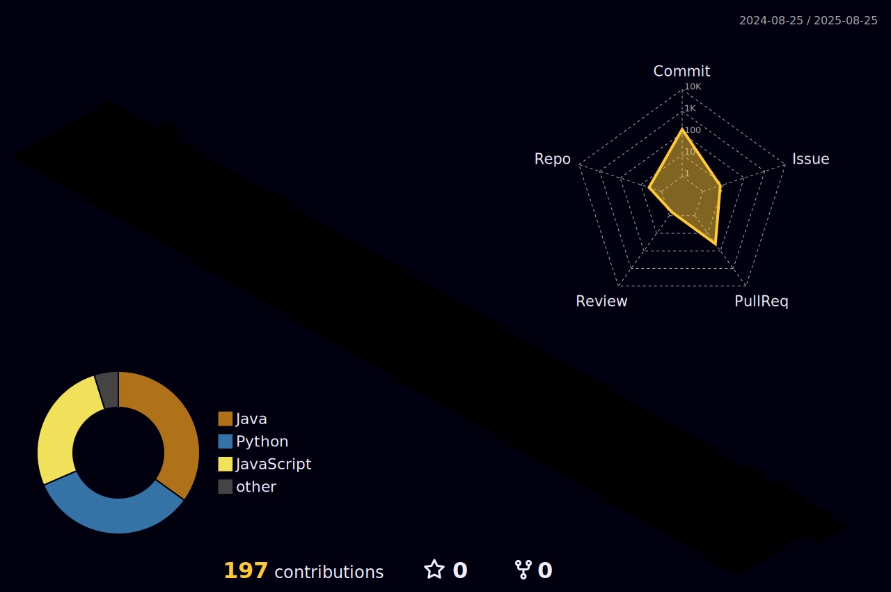

## Hi I'm JI SEOMUN 👋

    

    <h2 style="border-bottom: 1px solid #d8dee4; color: #282d33;"> 🛠️ Tech Stacks </h2>   
    
 
          
          
          
          
           
          
          
          
          
           
          
          
          
          
           
          
          
          
          

    

    
 
    

    
    
    
